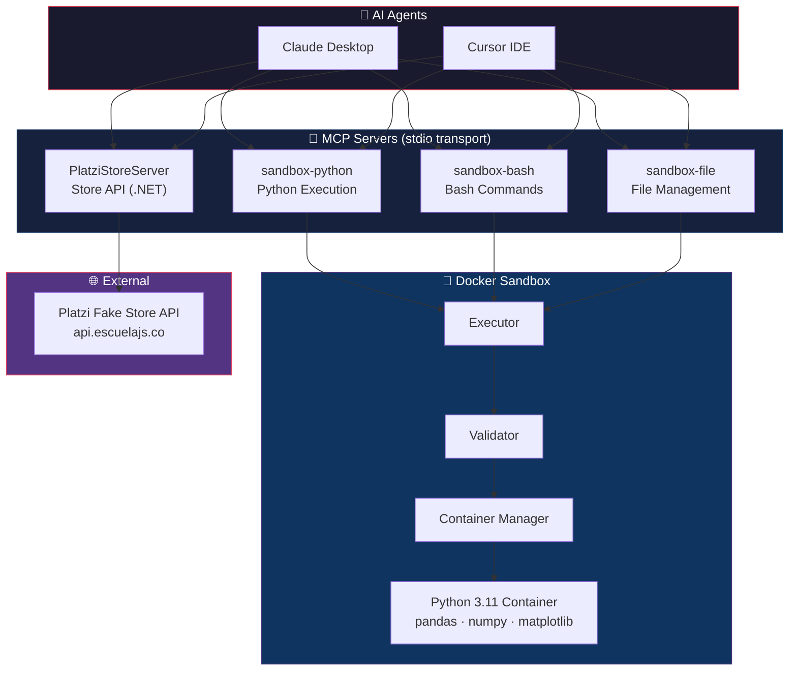
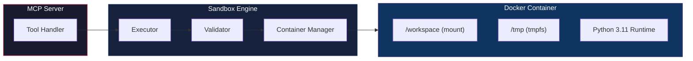
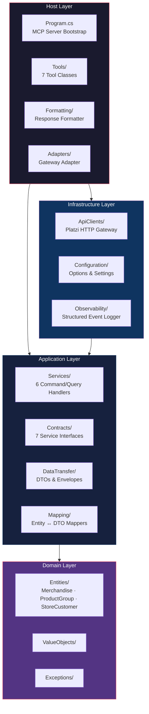
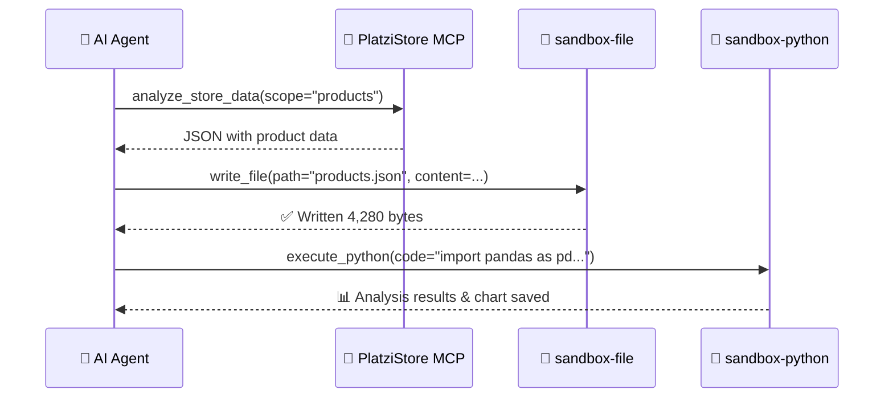

<p align="center">
  
  
  
  
  
</p>

# 🧰 Sandbox MCP Tools

> **A modular AI tooling platform that exposes sandboxed Python execution, Bash commands, file management, and e-commerce store operations as Model Context Protocol (MCP) servers — enabling AI agents like Claude and Cursor to safely perform complex, multi-step workflows.**

---

## 📋 Table of Contents

- [Project Overview](#-project-overview)
- [Key Features](#-key-features)
- [System Architecture](#-system-architecture)
- [Repository Structure](#-repository-structure)
- [MCP Servers](#-mcp-servers)
- [Python Sandbox](#-python-sandbox)
- [.NET MCP Server — Platzi Store](#-net-mcp-server--platzi-store)
- [Tool Orchestration](#-tool-orchestration)
- [Example AI Workflows](#-example-ai-workflows)
- [Installation](#-installation)
- [Running MCP Servers](#-running-mcp-servers)
- [Running Tests](#-running-tests)
- [Technologies Used](#-technologies-used)
- [Contributing](#-contributing)
- [License](#-license)

---

## 🌐 Project Overview

**Sandbox MCP Tools** is a monorepo that combines **sandboxed code execution** with **e-commerce API integration**, all orchestrated through the [Model Context Protocol (MCP)](https://modelcontextprotocol.io/). It enables AI agents to:

- Execute Python code and Bash commands in an **isolated Docker container** with security controls
- Read, write, and manage files within a sandboxed workspace
- Interact with a **live e-commerce store API** (Platzi Fake Store) for product, category, and customer management
- **chain tools across servers** to perform end-to-end data analysis workflows

The project is built as a **production-quality portfolio piece**, featuring clean architecture, comprehensive testing, and structured observability.

---

## ✨ Key Features

| Feature | Description |
|---------|-------------|
| 🔌 **MCP Tool Architecture** | 4 MCP servers exposing **32 tools** via the standard JSON-RPC/stdio transport |
| 🐳 **Sandboxed Execution** | Docker container with resource limits, network isolation, and command blocklists |
| 🤖 **AI Agent Orchestration** | Works with Claude Desktop and Cursor IDE out of the box |
| 🛒 **Platzi Store Integration** | Full CRUD for products, categories, customers, and authentication |
| 🐍 **Python + Bash Execution** | Run inline code, scripts, and shell commands safely inside the sandbox |
| 📁 **File Management** | Read, write, and list files within the isolated workspace |
| 🔗 **Sandbox Bridge** | Export store data as JSON/NDJSON directly into the sandbox for analysis |
| 📊 **Data Science Ready** | Pre-installed pandas, numpy, matplotlib, seaborn, scikit-learn |
| 🏗️ **Clean Architecture (.NET)** | Domain → Application → Infrastructure → Host layered design |
| ✅ **Comprehensive Testing** | Python unit/integration tests + .NET xUnit tests with Moq |

---

## 🏗️ System Architecture

### High-Level Overview



### Communication Flow

```
AI Agent (e.g. Cursor)
  │
  ├── stdio (JSON-RPC) ──→  sandbox-python   ──→ Docker Container
  ├── stdio (JSON-RPC) ──→  sandbox-bash     ──→ Docker Container
  ├── stdio (JSON-RPC) ──→  sandbox-file     ──→ Docker Container
  └── stdio (JSON-RPC) ──→  PlatziStoreServer ──→ Platzi REST API
```

Each MCP server runs as a **separate process** that communicates via **stdin/stdout** using the MCP JSON-RPC protocol. The AI agent discovers available tools, invokes them with structured parameters, and receives structured responses.

---

## 📂 Repository Structure

```
sandbox-mcp-tools/
├── src/                          # Python source code
│   ├── sandbox/                  # 🐳 Sandbox core engine
│   │   ├── config.py             #    Container & security configuration
│   │   ├── container.py          #    Docker container lifecycle manager
│   │   ├── executor.py           #    Command execution engine
│   │   └── validator.py          #    Command & path security validator
│   └── servers/                  # 🔌 Python MCP servers
│       ├── python_server.py      #    sandbox-python  (2 tools)
│       ├── bash_server.py        #    sandbox-bash    (1 tool)
│       ├── file_server.py        #    sandbox-file    (3 tools)
│       └── response.py           #    Shared response formatting
│
├── store-mcp/                    # 🛒 .NET MCP server (Platzi Store)
│   ├── src/
│   │   ├── PlatziStore.Domain/       # Entities, Value Objects, Exceptions
│   │   ├── PlatziStore.Application/  # Contracts, Services, Mapping, DTOs
│   │   ├── PlatziStore.Infrastructure/ # API client, Config, Observability
│   │   ├── PlatziStore.Host/         # MCP server entry point & Tools
│   │   └── PlatziStore.Shared/       # Cross-cutting models & utilities
│   └── tests/                        # xUnit test projects
│       ├── PlatziStore.Host.Tests/
│       ├── PlatziStore.Application.Tests/
│       └── PlatziStore.Infrastructure.Tests/
│
├── docker/                       # 🐳 Sandbox Docker image
│   └── Dockerfile                #    Python 3.11-slim + data science libs
│
├── tests/                        # 🧪 Python test suite
│   ├── unit/                     #    Unit tests (validator, servers)
│   └── integration/              #    Integration tests (container, executor)
│
├── docs/                         # 📚 Documentation
│   ├── mcp-explained.md          #    MCP protocol deep-dive
│   ├── python-mcp.md             #    Python MCP server guide
│   └── platzi-mcp-extension.md   #    Platzi Store MCP reference
│
├── workspaces/default/           # 📁 Mounted workspace for the sandbox
├── pyproject.toml                # Python project configuration
└── LICENSE                       # MIT License
```

---

## 🔌 MCP Servers

This project runs **4 MCP servers** exposing a total of **32 tools** to AI agents.

### Python Sandbox Servers

These three servers share the Docker sandbox backend:

#### `sandbox-python` — Python Code Execution

| Tool | Description |
|------|-------------|
| `execute_python` | Execute inline Python code inside the sandbox container |
| `execute_python_file` | Execute an existing `.py` file from the workspace |

#### `sandbox-bash` — Bash Command Execution

| Tool | Description |
|------|-------------|
| `execute_bash` | Execute a bash command inside the sandbox container |

#### `sandbox-file` — File System Operations

| Tool | Description |
|------|-------------|
| `read_file` | Read file contents from the sandbox workspace |
| `write_file` | Write text content to a file, creating parent directories |
| `list_files` | List directory contents with file sizes |

### .NET Platzi Store Server

The `PlatziStoreServer` exposes **26 tools** organized into functional groups:

| Tool Group | Tools | Description |
|-----------|-------|-------------|
| **Catalog Browsing** | `list_store_products`, `get_product_by_id`, `get_product_by_slug`, `find_related_products`, `find_related_by_slug`, `filter_store_products` | Browse, search, and filter products |
| **Catalog Management** | `create_store_product`, `update_store_product`, `remove_store_product` | CRUD operations for products |
| **Category Browsing** | `list_store_categories`, `get_category_by_id`, `get_category_by_slug`, `list_products_in_category` | Navigate product categories |
| **Category Management** | `create_store_category`, `update_store_category`, `remove_store_category` | CRUD operations for categories |
| **Customer Accounts** | `list_store_customers`, `get_customer_by_id`, `register_customer`, `update_customer_profile`, `check_email_availability` | Customer management |
| **Identity & Access** | `authenticate_customer`, `get_authenticated_profile`, `refresh_access_token` | Authentication & authorization |
| **Sandbox Bridge** | `analyze_store_data`, `process_store_export` | Export store data (JSON/NDJSON) for sandbox analysis |

---

## 🐳 Python Sandbox

The sandbox is a **hardened Docker container** designed for safe AI-driven code execution.

### Architecture



### Security Controls

| Control | Configuration |
|---------|--------------|
| **Network** | `none` — completely air-gapped |
| **Memory** | `512 MB` limit |
| **CPU** | `0.5` cores |
| **PIDs** | Max `64` processes |
| **Filesystem** | Read-only root + `/tmp` tmpfs (64 MB) |
| **User** | Non-root `sandbox` user (UID 1000) |
| **Workspace** | `/workspace` mounted from `workspaces/default/` |

### Command Blocklist

The validator rejects commands containing:

- **Destructive patterns** — `rm -rf /`, `mkfs`, `dd if=`
- **System commands** — `shutdown`, `reboot`, `mount`
- **Privilege escalation** — `sudo`, `su`, `chown`
- **Dangerous permissions** — `chmod 777`
- **Fork bombs** — `:(){ :|:& };:`
- **Network tools** — `curl`, `wget`, `nc`, `ssh`, `scp`

### Pre-installed Libraries

The sandbox container comes with a data science stack:

```
pandas · numpy · matplotlib · seaborn · scikit-learn · openpyxl
```

---

## 🏢 .NET MCP Server — Platzi Store

The `store-mcp` project is a .NET 9 MCP server built with **Clean Architecture** principles.

### Architecture Layers



| Layer | Project | Responsibility |
|-------|---------|---------------|
| **Domain** | `PlatziStore.Domain` | Entities (`Merchandise`, `ProductGroup`, `StoreCustomer`), Value Objects, domain exceptions |
| **Application** | `PlatziStore.Application` | Service contracts, CQRS handlers, DTOs, entity-DTO mapping |
| **Infrastructure** | `PlatziStore.Infrastructure` | HTTP client for Platzi API, retry/timeout config, structured event logging |
| **Host** | `PlatziStore.Host` | MCP server bootstrap, tool definitions, response formatting, gateway adapter |
| **Shared** | `PlatziStore.Shared` | Cross-cutting models, utilities, and shared exception types |

### How It Works

1. The MCP client (AI agent) sends a **tool call** via stdio
2. `Program.cs` routes it to the matching `[McpServerTool]` method
3. The tool invokes an **Application layer handler** (CQRS pattern)
4. The handler calls `IStoreGateway` → routed via **adapter** to Infrastructure's `IPlatziStoreGateway`
5. Infrastructure sends an **HTTP request** to `https://api.escuelajs.co`
6. The response is **mapped** from API model → domain entity → DTO → formatted text
7. The formatted result is returned to the AI agent

---

## 🔗 Tool Orchestration

One of the most powerful features is **cross-server tool orchestration** — combining tools from multiple MCP servers in a single workflow.

### Multi-Server Workflow



### Sandbox Bridge

The **Sandbox Bridge** tools (`analyze_store_data`, `process_store_export`) enable seamless data flow between the Platzi Store API and the Python sandbox:

```
┌─────────────┐    JSON/NDJSON    ┌──────────────┐    write_file    ┌──────────────┐
│ Platzi API   │ ──────────────→ │ Store MCP     │ ──────────────→ │ Sandbox File │
└─────────────┘                  └──────────────┘                  └──────┬───────┘
                                                                          │
                                                                   execute_python
                                                                          │
                                                                   ┌──────▼───────┐
                                                                   │ Python Code  │
                                                                   │ pandas, plt  │
                                                                   └──────────────┘
```

---

## 💡 Example AI Workflows

### 1. Product Price Analysis

> **Prompt**: *"Fetch all products from the store, save them to a JSON file, and create a price distribution histogram using matplotlib."*

The AI agent will:
1. Call `analyze_store_data(dataScope="products")`
2. Call `write_file(path="products.json", content=<data>)`
3. Call `execute_python` with:

```python
import json
import matplotlib.pyplot as plt

with open('/workspace/products.json') as f:
    products = json.load(f)

prices = [p['price'] for p in products]
plt.figure(figsize=(10, 6))
plt.hist(prices, bins=20, color='#e94560', edgecolor='white')
plt.title('Product Price Distribution')
plt.xlabel('Price ($)')
plt.ylabel('Count')
plt.savefig('/workspace/price_distribution.png', dpi=150)
print(f"Chart saved. Analyzed {len(prices)} products.")
```

### 2. Category Inventory Report

> **Prompt**: *"List all categories and count how many products are in each one. Format the results as a markdown table."*

### 3. Customer Data Export

> **Prompt**: *"Export all customer data as NDJSON, then use bash to count the total number of users and find unique email domains."*

```bash
# The agent calls process_store_export → write_file → execute_bash:
cat /workspace/users.ndjson | wc -l
cat /workspace/users.ndjson | jq -r '.email' | awk -F@ '{print $2}' | sort -u
```

### 4. Price Filtering with Analysis

> **Prompt**: *"Find all products under $50, save them, and calculate the average price using Python."*

---

## 🚀 Installation

### Prerequisites

- **Python** 3.10+
- **Docker Desktop** (running)
- **.NET SDK** 9.0+ (for the Platzi Store MCP server)
- **Git**

### 1. Clone the Repository

```bash
git clone https://github.com/Rynvasis/sandbox-mcp-tools.git
cd sandbox-mcp-tools
```

### 2. Python Setup

```bash
# Create virtual environment
python -m venv .venv

# Activate it
# Windows (PowerShell)
.\.venv\Scripts\Activate.ps1
# macOS/Linux
source .venv/bin/activate

# Install dependencies
pip install -e ".[dev]"
```

### 3. Build the Sandbox Docker Image

```bash
cd docker
docker build -t sandbox-mcp-tools:latest .
cd ..
```

### 4. .NET Setup

```bash
cd store-mcp
dotnet restore
dotnet build
cd ..
```

---

## ▶️ Running MCP Servers

### Python Sandbox Servers

Each server runs as a standalone process on stdio:

```bash
# Python execution server
python -m src.servers.python_server

# Bash execution server
python -m src.servers.bash_server

# File management server
python -m src.servers.file_server
```

### .NET Platzi Store Server

```bash
cd store-mcp
dotnet run --project src/PlatziStore.Host
```

### Cursor IDE Configuration

Add the servers to your `.cursor/mcp.json`:

```json
{
  "mcpServers": {
    "sandbox-python": {
      "command": "python",
      "args": ["-m", "src.servers.python_server"],
      "cwd": "/path/to/sandbox-mcp-tools"
    },
    "sandbox-bash": {
      "command": "python",
      "args": ["-m", "src.servers.bash_server"],
      "cwd": "/path/to/sandbox-mcp-tools"
    },
    "sandbox-file": {
      "command": "python",
      "args": ["-m", "src.servers.file_server"],
      "cwd": "/path/to/sandbox-mcp-tools"
    },
    "platzi-store": {
      "command": "dotnet",
      "args": ["run", "--project", "store-mcp/src/PlatziStore.Host"],
      "cwd": "/path/to/sandbox-mcp-tools"
    }
  }
}
```

---

## 🧪 Running Tests

### Python Tests

```bash
# Run all tests
pytest

# Run unit tests only
pytest tests/unit/

# Run integration tests (requires Docker)
pytest tests/integration/

# Run with verbose output
pytest -v
```

### .NET Tests

```bash
cd store-mcp

# Run all test projects
dotnet test

# Run a specific test project
dotnet test tests/PlatziStore.Host.Tests/
dotnet test tests/PlatziStore.Application.Tests/
dotnet test tests/PlatziStore.Infrastructure.Tests/
```

---

## 🛠️ Technologies Used

| Category | Technologies |
|----------|-------------|
| **Languages** | Python 3.10+ · C# / .NET 9 |
| **Protocols** | Model Context Protocol (MCP) · JSON-RPC · stdio transport |
| **Containerization** | Docker · Docker SDK for Python |
| **Python Libraries** | FastMCP · pandas · numpy · matplotlib · seaborn · scikit-learn · openpyxl |
| **Web Framework** | ASP.NET (DI + hosted services) |
| **Testing** | pytest · pytest-asyncio · xUnit · Moq |
| **Architecture** | Clean Architecture · CQRS · Dependency Injection · Adapter Pattern |
| **Observability** | Structured event logging · telemetry configuration |
| **Development** | Hatchling (Python build) |
| **AI Agents** | Claude Desktop · Cursor IDE |

---

## 🤝 Contributing

Contributions are welcome! Here's how to get started:

1. **Fork** the repository
2. **Create** a feature branch (`git checkout -b feature/amazing-feature`)
3. **Commit** your changes (`git commit -m 'Add amazing feature'`)
4. **Push** to the branch (`git push origin feature/amazing-feature`)
5. **Open** a Pull Request

### Development Guidelines

- Follow existing code conventions and architecture patterns
- Add tests for new functionality (both unit and integration)
- Ensure Docker is running for integration tests
- Run `pytest` and `dotnet test` before submitting PRs

---

## 📄 License

This project is licensed under the **MIT License** — see the [LICENSE](LICENSE) file for details.

```
MIT License · Copyright (c) 2026 Ahmed Raed
```
