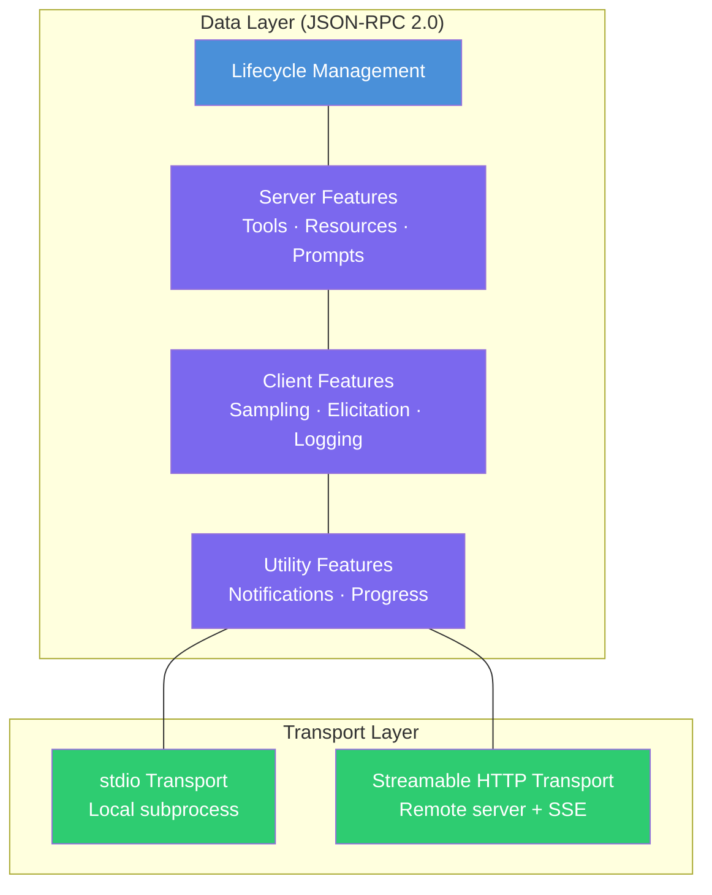
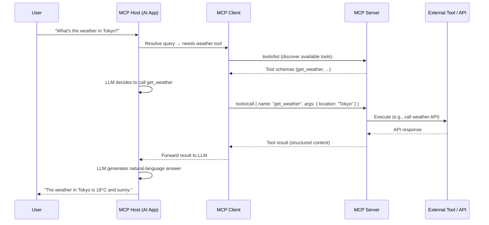
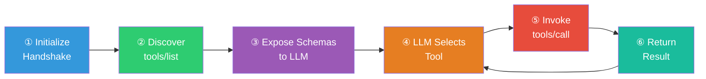
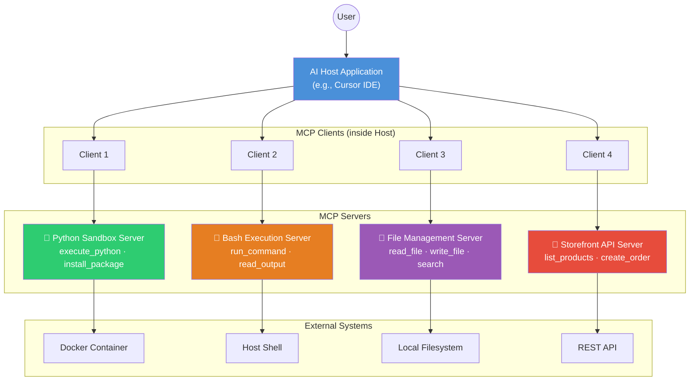
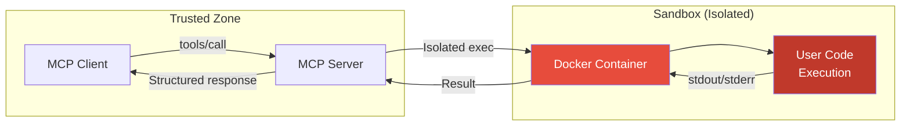
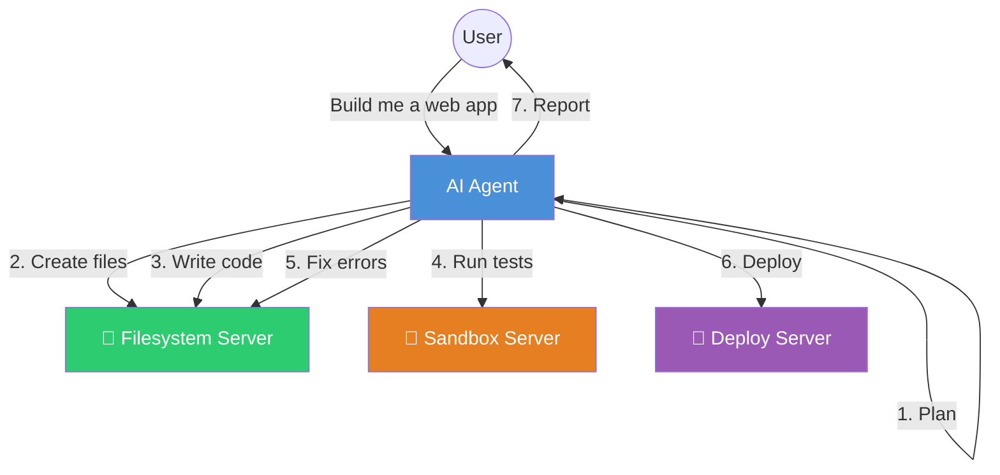

# Model Context Protocol (MCP) — Complete Guide

> **A comprehensive, developer-focused guide to understanding and working with the Model Context Protocol.**
>
> Based on the [official MCP documentation](https://modelcontextprotocol.io/docs/).

---

## Table of Contents

1. [Introduction](#1-introduction)
2. [Core Concepts](#2-core-concepts)
3. [MCP Architecture](#3-mcp-architecture)
4. [MCP Communication Flow](#4-mcp-communication-flow)
5. [Tool Definition](#5-tool-definition)
6. [Example MCP Tool](#6-example-mcp-tool)
7. [MCP in Real Projects](#7-mcp-in-real-projects)
8. [Example Architecture](#8-example-architecture)
9. [Security Considerations](#9-security-considerations)
10. [Advantages of MCP](#10-advantages-of-mcp)
11. [MCP vs Traditional APIs](#11-mcp-vs-traditional-apis)
12. [MCP in AI Development](#12-mcp-in-ai-development)
13. [Further Reading](#13-further-reading)

---

## 1. Introduction

### What Is MCP?

The **Model Context Protocol (MCP)** is an open, standardized protocol that defines how AI applications (such as LLM-powered assistants) discover, connect to, and invoke external tools and data sources. It was created by [Anthropic](https://www.anthropic.com/) and is now broadly adopted across the AI ecosystem.

Think of MCP as the **"USB-C for AI integrations"** — a single, universal interface that lets any AI application plug into any tool or data source, regardless of who built either side.

### Why Does MCP Exist?

Before MCP, every AI tool integration was a custom, one-off implementation:

- Each AI product had its own plugin format.
- Tool developers had to build separate integrations for every AI host.
- There was no standard way to describe tool capabilities, invoke them, or handle results.

This led to a fragmented ecosystem with duplicated effort, inconsistent behavior, and poor interoperability.

### The Problem MCP Solves

| Without MCP | With MCP |
|---|---|
| N AI apps × M tools = N×M custom integrations | N AI apps × M tools = N + M standard implementations |
| Each integration is bespoke and fragile | A single protocol connects everything |
| No standard tool discovery or schema | Structured JSON schemas describe every tool |
| Security is ad-hoc | Security model built into the protocol |

### Why AI Systems Need a Protocol for Tools

Large Language Models are powerful reasoners, but they **cannot act on the world** without access to external tools. A tool protocol is essential because:

- **Discovery** — The AI must know *what tools exist* and what they can do.
- **Schema** — The AI must know the *exact input parameters* a tool expects.
- **Invocation** — There must be a reliable way to *call* a tool and receive a structured result.
- **Safety** — Tool calls can have real-world side effects; the protocol must enforce guardrails.
- **Composability** — An AI system may need to use *many* tools from *different providers* simultaneously.

MCP solves all of these.

---

## 2. Core Concepts

### MCP Host

The **MCP Host** is the AI application that coordinates and manages one or more MCP Clients. This is the outer "shell" the user interacts with.

**Examples of Hosts:**
- [Claude Desktop](https://www.claude.ai/download)
- [Claude Code](https://www.anthropic.com/claude-code)
- [Cursor IDE](https://cursor.com)
- [Visual Studio Code (Copilot)](https://code.visualstudio.com)
- [ChatGPT](https://chat.openai.com)

### MCP Client

The **MCP Client** is a component *inside* the host that maintains a 1:1 connection to a single MCP Server. A host can run many clients simultaneously, each connected to a different server.

**Responsibilities:**
- Establish and maintain the connection to the server.
- Negotiate capabilities during the initialization handshake.
- Forward tool schemas to the host's AI model.
- Route tool invocations from the AI to the correct server.

### MCP Server

The **MCP Server** is a program that exposes tools, resources, and prompts to MCP Clients. It runs as a separate process (local or remote).

**Examples:**
- A **filesystem server** that exposes `read_file`, `write_file`, `list_directory` tools.
- A **database server** that exposes `query` and `execute` tools.
- An **API server** that wraps a third-party REST API as MCP tools.

```
┌─────────────────────────────────────────┐
│              MCP Host                   │
│  (e.g. Claude Desktop, Cursor IDE)      │
│                                         │
│  ┌───────────┐  ┌───────────┐           │
│  │ MCP Client│  │ MCP Client│   ...     │
│  └─────┬─────┘  └─────┬─────┘          │
└────────┼───────────────┼────────────────┘
         │               │
         ▼               ▼
   ┌───────────┐   ┌───────────┐
   │MCP Server │   │MCP Server │
   │(Filesystem│   │(Database) │
   └───────────┘   └───────────┘
```

### Tools

**Tools** are executable functions that an AI model can invoke to perform actions. They are the primary mechanism through which AI models interact with the external world via MCP.

A tool is defined by:
- **`name`** — A unique machine-readable identifier (e.g., `read_file`).
- **`title`** — An optional human-readable display name.
- **`description`** — A natural-language explanation of what the tool does.
- **`inputSchema`** — A JSON Schema defining the expected input parameters.
- **`outputSchema`** — An optional JSON Schema defining the expected output.
- **`annotations`** — Optional metadata describing tool behavior and side effects.

### Tool Schemas

Every MCP tool is described by a **JSON Schema** that the AI model uses to understand what arguments the tool expects. This is critical because it allows the model to *autonomously construct valid calls*.

```json
{
  "name": "get_weather",
  "title": "Weather Information Provider",
  "description": "Get current weather information for a location",
  "inputSchema": {
    "type": "object",
    "properties": {
      "location": {
        "type": "string",
        "description": "City name or zip code"
      }
    },
    "required": ["location"]
  }
}
```

### Tool Invocation

Tool invocation follows the **JSON-RPC 2.0** protocol. The client sends a `tools/call` request with the tool name and arguments, and the server responds with structured content.

**Request:**
```json
{
  "jsonrpc": "2.0",
  "id": 2,
  "method": "tools/call",
  "params": {
    "name": "get_weather",
    "arguments": {
      "location": "New York"
    }
  }
}
```

**Response:**
```json
{
  "jsonrpc": "2.0",
  "id": 2,
  "result": {
    "content": [
      {
        "type": "text",
        "text": "Current weather in New York:\nTemperature: 72°F\nConditions: Partly cloudy"
      }
    ],
    "isError": false
  }
}
```

### Context Exchange

MCP enables a rich **context exchange** between AI models and external systems through three primitives:

| Primitive | Direction | Purpose |
|---|---|---|
| **Tools** | Client → Server | Invoke actions (read files, query APIs, execute code) |
| **Resources** | Client ← Server | Retrieve contextual data (file contents, database records) |
| **Prompts** | Client ← Server | Reusable interaction templates (system prompts, few-shot examples) |

Additionally, **Sampling** allows servers to request LLM completions from the client, enabling sophisticated server-side reasoning without bundling an LLM SDK.

---

## 3. MCP Architecture

MCP is built on a **layered architecture** with clearly separated concerns:

### Architectural Layers



### Data Layer

The **Data Layer** defines the JSON-RPC based protocol for client-server communication. It includes:

- **Lifecycle Management** — Connection initialization, capability negotiation, and termination.
- **Server Features** — Tools, Resources, and Prompts that servers expose to clients.
- **Client Features** — Sampling, Elicitation, and Logging that clients offer to servers.
- **Utility Features** — Notifications for real-time updates and progress tracking.

### Transport Layer

The **Transport Layer** defines *how* messages move between client and server:

| Transport | Use Case | How It Works |
|---|---|---|
| **stdio** | Local tools, same machine | Client spawns server as a subprocess; messages flow over stdin/stdout |
| **Streamable HTTP** | Remote tools, cloud services | HTTP POST for requests; Server-Sent Events (SSE) for streaming responses |

### End-to-End Architecture Diagram



---

## 4. MCP Communication Flow

MCP communication follows a well-defined sequence. Here is the step-by-step flow:

### Step 1: Connection Initialization

The client connects to the server and performs a **capability handshake**:

```json
// Client → Server: initialize request
{
  "jsonrpc": "2.0",
  "id": 1,
  "method": "initialize",
  "params": {
    "protocolVersion": "2025-06-18",
    "capabilities": {},
    "clientInfo": {
      "name": "CursorIDE",
      "version": "1.0.0"
    }
  }
}
```

```json
// Server → Client: initialize response
{
  "jsonrpc": "2.0",
  "id": 1,
  "result": {
    "protocolVersion": "2025-06-18",
    "capabilities": {
      "tools": { "listChanged": true }
    },
    "serverInfo": {
      "name": "filesystem-server",
      "version": "2.0.0"
    }
  }
}
```

### Step 2: Tool Discovery

The client requests the list of available tools:

```json
// Client → Server
{
  "jsonrpc": "2.0",
  "id": 2,
  "method": "tools/list",
  "params": {}
}
```

```json
// Server → Client
{
  "jsonrpc": "2.0",
  "id": 2,
  "result": {
    "tools": [
      {
        "name": "read_file",
        "description": "Read the contents of a file",
        "inputSchema": {
          "type": "object",
          "properties": {
            "path": { "type": "string", "description": "Absolute file path" }
          },
          "required": ["path"]
        }
      },
      {
        "name": "write_file",
        "description": "Write content to a file",
        "inputSchema": {
          "type": "object",
          "properties": {
            "path": { "type": "string", "description": "Absolute file path" },
            "content": { "type": "string", "description": "File content" }
          },
          "required": ["path", "content"]
        }
      }
    ]
  }
}
```

### Step 3: Tool Schema Exposure to the LLM

The host injects the tool schemas into the LLM's context so the model knows what tools are available, what they do, and what arguments they require.

### Step 4: AI Decides Which Tool to Use

Based on the user's query and the available tool schemas, the LLM autonomously selects the appropriate tool and constructs a valid call.

### Step 5: Tool Invocation

The client forwards the LLM's tool call to the server:

```json
{
  "jsonrpc": "2.0",
  "id": 3,
  "method": "tools/call",
  "params": {
    "name": "read_file",
    "arguments": {
      "path": "/home/user/project/README.md"
    }
  }
}
```

### Step 6: Response Handling

The server executes the tool and returns a structured result:

```json
{
  "jsonrpc": "2.0",
  "id": 3,
  "result": {
    "content": [
      {
        "type": "text",
        "text": "# My Project\n\nA sample project README."
      }
    ],
    "isError": false
  }
}
```

### Communication Flow Diagram



---

## 5. Tool Definition

### Tool Schema Structure

Every MCP tool is described by a JSON object with the following fields:

| Field | Type | Required | Description |
|---|---|---|---|
| `name` | `string` | ✅ | Unique machine-readable identifier |
| `title` | `string` | ❌ | Human-readable display name |
| `description` | `string` | ✅ | Natural-language explanation of the tool's purpose |
| `inputSchema` | `object` | ✅ | JSON Schema defining accepted parameters |
| `outputSchema` | `object` | ❌ | JSON Schema defining expected result structure |
| `annotations` | `object` | ❌ | Metadata about tool behavior (side effects, idempotency, etc.) |

### Complete Tool Schema Example

```json
{
  "name": "search_database",
  "title": "Database Search",
  "description": "Search records in a database table by field value",
  "inputSchema": {
    "type": "object",
    "properties": {
      "table": {
        "type": "string",
        "description": "Name of the database table to search"
      },
      "field": {
        "type": "string",
        "description": "Column name to filter by"
      },
      "value": {
        "type": "string",
        "description": "Value to search for"
      },
      "limit": {
        "type": "integer",
        "description": "Maximum number of results to return",
        "default": 10
      }
    },
    "required": ["table", "field", "value"]
  },
  "outputSchema": {
    "type": "object",
    "properties": {
      "rows": {
        "type": "array",
        "description": "Matching database rows",
        "items": { "type": "object" }
      },
      "total": {
        "type": "integer",
        "description": "Total number of matching records"
      }
    },
    "required": ["rows", "total"]
  },
  "annotations": {
    "readOnlyHint": true,
    "openWorldHint": false
  }
}
```

### Tool Result Types

MCP supports multiple content types in tool results:

| Type | Description | Use Case |
|---|---|---|
| `text` | Plain text content | Log output, file contents, status messages |
| `image` | Base64-encoded image | Screenshots, generated charts |
| `audio` | Base64-encoded audio | Audio recordings, TTS output |
| `resource_link` | Reference to an MCP resource | Linking to files without embedding content |
| `resource` | Embedded resource content | Inline file contents with metadata |

---

## 6. Example MCP Tool

Let's walk through a complete `read_file` tool implementation from definition to response.

### Tool Definition

```json
{
  "name": "read_file",
  "title": "File Reader",
  "description": "Read the complete contents of a file from the filesystem. Returns the file content as text. Only works within the allowed directory.",
  "inputSchema": {
    "type": "object",
    "properties": {
      "path": {
        "type": "string",
        "description": "Absolute path to the file to read"
      }
    },
    "required": ["path"]
  }
}
```

### Example Request

The AI model determines it needs to read a file and constructs the call:

```json
{
  "jsonrpc": "2.0",
  "id": 5,
  "method": "tools/call",
  "params": {
    "name": "read_file",
    "arguments": {
      "path": "/home/user/project/src/main.py"
    }
  }
}
```

### Server-Side Execution (Python)

Here's what the server does internally when it receives this call:

```python
from mcp.server import Server
from mcp.types import Tool, TextContent
import os

server = Server("filesystem-server")

@server.tool()
async def read_file(path: str) -> list[TextContent]:
    """Read the complete contents of a file from the filesystem."""
    # Security: validate path is within allowed directory
    allowed_dir = "/home/user/project"
    real_path = os.path.realpath(path)
    if not real_path.startswith(allowed_dir):
        raise ValueError(f"Access denied: {path} is outside {allowed_dir}")

    # Read and return the file
    with open(real_path, "r", encoding="utf-8") as f:
        content = f.read()

    return [TextContent(type="text", text=content)]
```

### Example Response

#### Success

```json
{
  "jsonrpc": "2.0",
  "id": 5,
  "result": {
    "content": [
      {
        "type": "text",
        "text": "#!/usr/bin/env python3\n\ndef main():\n    print(\"Hello, MCP!\")\n\nif __name__ == \"__main__\":\n    main()\n"
      }
    ],
    "isError": false
  }
}
```

#### Error (file not found)

```json
{
  "jsonrpc": "2.0",
  "id": 5,
  "result": {
    "content": [
      {
        "type": "text",
        "text": "Error: File not found: /home/user/project/src/missing.py"
      }
    ],
    "isError": true
  }
}
```

#### Protocol Error (invalid tool name)

```json
{
  "jsonrpc": "2.0",
  "id": 5,
  "error": {
    "code": -32602,
    "message": "Unknown tool: read_fiel"
  }
}
```

---

## 7. MCP in Real Projects

MCP is designed for real-world production use. Here are common categories of MCP servers deployed today:

### File Systems

A filesystem MCP server gives AI models controlled access to read, write, and manage files.

**Typical tools:**
- `read_file` — Read file contents
- `write_file` — Create or overwrite a file
- `list_directory` — List files and folders
- `search_files` — Find files by pattern
- `move_file` — Rename or move files

> **Reference:** [Official Filesystem Server](https://github.com/modelcontextprotocol/servers/tree/main/src/filesystem)

### Code Execution Sandboxes

Sandbox servers allow AI models to execute code safely in isolated environments (Docker containers, VMs, WebAssembly runtimes).

**Typical tools:**
- `execute_python` — Run Python code in a sandbox
- `execute_bash` — Run shell commands
- `install_package` — Install dependencies in the sandbox

**Key security features:**
- Resource limits (CPU, memory, disk)
- Network isolation
- Timeout enforcement
- Read-only host filesystem mounts

### API Integrations

MCP servers can wrap any REST or GraphQL API, exposing it as a set of tools the AI can call.

**Examples:**
- **GitHub MCP Server** — Create issues, search repos, review PRs
- **Sentry MCP Server** — Query errors, view stack traces, manage alerts
- **Slack MCP Server** — Send messages, search channels, manage users

### Database Access

Database MCP servers give AI models structured query access with safety guardrails.

**Typical tools:**
- `query` — Execute a read-only SQL query
- `list_tables` — Show available tables
- `describe_table` — Show column definitions

**Safety features:**
- Read-only mode by default
- Query complexity limits
- Row count limits
- Parameterized queries to prevent SQL injection

---

## 8. Example Architecture

A real AI application connects to **multiple MCP servers** simultaneously, each providing a different capability domain:

### Multi-Server Architecture Diagram



### How It Works

1. **The Host** (AI application) initializes one **MCP Client** per server.
2. Each client connects to its server and retrieves the available tool schemas.
3. **All tool schemas** from all servers are combined and presented to the LLM.
4. When the LLM decides to call a tool, the host routes the call to the correct client → server.
5. Results flow back through the same path.

This architecture is **horizontally scalable** — adding a new capability is as simple as deploying a new MCP server and connecting a client to it.

### Text Representation

```
AI Host (Cursor IDE)
├── MCP Client → 🐍 Python Sandbox Server
│   ├── execute_python
│   └── install_package
├── MCP Client → 🐚 Bash Execution Server
│   ├── run_command
│   └── read_output
├── MCP Client → 📁 File Management Server
│   ├── read_file
│   ├── write_file
│   └── search_files
└── MCP Client → 🛒 Storefront API Server
    ├── list_products
    ├── get_product
    └── create_order
```

---

## 9. Security Considerations

MCP servers interact with real systems — filesystems, databases, APIs, shells. **Security is not optional.** The protocol defines clear responsibilities for both servers and clients.

### Server Responsibilities

| Requirement | Description |
|---|---|
| **Input validation** | Validate all tool inputs against the declared schema |
| **Access controls** | Enforce permissions per tool and per resource |
| **Rate limiting** | Prevent abuse by limiting tool invocation frequency |
| **Output sanitization** | Ensure tool outputs don't leak sensitive data |
| **Origin validation** | Validate the `Origin` header on HTTP connections to prevent DNS rebinding |
| **Localhost binding** | When running locally, bind only to `127.0.0.1`, not `0.0.0.0` |

### Client Responsibilities

| Requirement | Description |
|---|---|
| **Human-in-the-loop** | Prompt users for confirmation on sensitive or destructive operations |
| **Input inspection** | Show tool inputs to the user before sending them to prevent data exfiltration |
| **Result validation** | Validate tool results before passing them to the LLM |
| **Timeout enforcement** | Implement timeouts for all tool calls |
| **Audit logging** | Log all tool usage for monitoring and compliance |

### Sandbox Execution

When MCP servers execute code or commands, they **must** run in sandboxed environments:



**Key sandbox properties:**
- **Filesystem isolation** — The sandbox can only access explicitly mounted directories.
- **Network isolation** — Outbound network access is blocked or allowlisted.
- **Resource limits** — CPU, memory, and disk quotas prevent resource exhaustion.
- **Timeout enforcement** — Long-running commands are automatically killed.
- **Read-only mounts** — Host directories are mounted read-only by default.

### Command Validation

Before executing commands, MCP servers should validate:

- **Allowed commands** — Use a command allowlist; block dangerous operations.
- **Argument sanitization** — Prevent shell injection attacks.
- **Path validation** — Ensure file paths stay within allowed directories.
- **Output truncation** — Limit output size to prevent memory exhaustion.

---

## 10. Advantages of MCP

### Modular AI Systems

MCP enables a **plug-and-play architecture** where each tool capability is a separate, independent server. This means:

- Teams can develop, deploy, and version tools independently.
- New capabilities are added without modifying the host application.
- Failed or misbehaving tools are isolated and don't crash the entire system.

### Tool Interoperability

A tool built once as an MCP server works with **every MCP-compatible host**:

- Build a GitHub integration once → use it in Claude, Cursor, VS Code, ChatGPT.
- No vendor-specific plugin formats.
- A growing ecosystem of pre-built servers available on [GitHub](https://github.com/modelcontextprotocol/servers).

### Safe Code Execution

MCP's architecture naturally supports sandboxing patterns:

- Tools that execute code run inside isolated containers.
- The protocol's structured I/O prevents injection attacks.
- Human-in-the-loop confirmation is a built-in expectation.

### Extensible Architectures

MCP is designed for extension:

- **Custom transports** — Beyond stdio and HTTP, you can implement custom transports.
- **Custom primitives** — Resources and Prompts complement Tools for rich context.
- **Capability negotiation** — Clients and servers agree on supported features during initialization.
- **Annotations** — Rich metadata describes tool behavior, side effects, and intended audience.

---

## 11. MCP vs Traditional APIs

### Comparison Table

| Aspect | REST APIs | SDK Integrations | MCP |
|---|---|---|---|
| **Discovery** | Requires reading documentation or OpenAPI specs | Known at compile time | Automatic via `tools/list` at runtime |
| **Schema** | OpenAPI / Swagger (optional) | Type definitions in code | JSON Schema embedded in tool definitions |
| **Invocation** | HTTP requests with custom auth | Direct function calls | Standardized JSON-RPC over any transport |
| **AI-Optimized** | ❌ Not designed for LLMs | ❌ Requires wrapper code | ✅ Built for LLM tool-use from the ground up |
| **Interoperability** | High (any HTTP client) | Low (language-specific) | High (any MCP client) |
| **Streaming** | Varies (SSE, WebSockets) | Varies | Built-in via SSE on HTTP transport |
| **Security Model** | Custom per API | Custom per SDK | Standardized (capabilities, confirmations) |
| **Context Sharing** | Not supported | Not supported | Built-in via Resources and Prompts |

### When to Use Each

- **REST APIs** — When building traditional web services for human-facing applications or machine-to-machine integrations that don't involve AI.
- **SDK Integrations** — When you need tight, language-specific integration with a service and AI is not involved.
- **MCP** — When you are building or extending an AI application that needs to discover and use tools dynamically, especially when:
  - The AI needs to select tools autonomously.
  - You want interoperability across multiple AI hosts.
  - You need a standard security and confirmation model.

### Key Differentiator

The fundamental difference is that MCP is **AI-native**:

- REST APIs are designed for developers who write code to call them.
- MCP is designed for **AI models** that autonomously discover, understand, and invoke tools with no human code in the loop.

---

## 12. MCP in AI Development

### Enabling Agentic Systems

MCP is a foundational building block for **agentic AI** — systems where AI models autonomously plan and execute multi-step workflows:



In an agentic system, the AI:
1. **Receives a high-level goal** from the user.
2. **Plans** a sequence of tool calls to achieve the goal.
3. **Executes** the plan, calling tools via MCP.
4. **Adapts** based on tool results (handles errors, retries, adjusts plan).
5. **Reports** the final result to the user.

### AI Automation

MCP enables AI to automate complex workflows that previously required manual orchestration:

- **CI/CD operations** — AI triggers builds, runs tests, deploys code.
- **Data pipelines** — AI queries databases, transforms data, generates reports.
- **System administration** — AI monitors logs, diagnoses issues, applies fixes.
- **Content creation** — AI researches topics, writes content, publishes to CMS.

### Tool-Using AI

MCP standardizes the concept of **tool-using AI** across the ecosystem:

| Capability | How MCP Enables It |
|---|---|
| **Web browsing** | Browser automation MCP server |
| **Code execution** | Sandboxed runtime MCP server |
| **File management** | Filesystem MCP server |
| **API access** | API wrapper MCP servers |
| **Database queries** | Database MCP server |
| **Image generation** | Generative AI MCP server |
| **Communication** | Email / Slack / Teams MCP servers |

The beauty of MCP is that the AI model doesn't need to know the implementation details of any of these —  it just sees a uniform set of tools with clear schemas and invokes them through a single protocol.

---

## 13. Further Reading

### Official Resources

| Resource | Link |
|---|---|
| **MCP Documentation** | [modelcontextprotocol.io/docs](https://modelcontextprotocol.io/docs/) |
| **MCP Specification** | [modelcontextprotocol.io/specification](https://modelcontextprotocol.io/specification/latest) |
| **Architecture Overview** | [Architecture](https://modelcontextprotocol.io/docs/learn/architecture) |
| **Tools Concept** | [Tools](https://modelcontextprotocol.io/docs/concepts/tools) |
| **Resources Concept** | [Resources](https://modelcontextprotocol.io/docs/concepts/resources) |
| **Transports** | [Transports](https://modelcontextprotocol.io/docs/concepts/transports) |

### SDKs & Development

| Resource | Link |
|---|---|
| **TypeScript SDK** | [github.com/modelcontextprotocol/typescript-sdk](https://github.com/modelcontextprotocol/typescript-sdk) |
| **Python SDK** | [github.com/modelcontextprotocol/python-sdk](https://github.com/modelcontextprotocol/python-sdk) |
| **MCP Inspector** | [github.com/modelcontextprotocol/inspector](https://github.com/modelcontextprotocol/inspector) |
| **Reference Servers** | [github.com/modelcontextprotocol/servers](https://github.com/modelcontextprotocol/servers) |

### Community & Ecosystem

| Resource | Link |
|---|---|
| **MCP GitHub Organization** | [github.com/modelcontextprotocol](https://github.com/modelcontextprotocol) |
| **MCP Clients Directory** | [modelcontextprotocol.io/clients](https://modelcontextprotocol.io/clients) |
| **MCP Servers Directory** | [modelcontextprotocol.io/servers](https://modelcontextprotocol.io/servers) |

---

> **Document version:** March 2026
>
> **Source:** Based on the [official MCP documentation](https://modelcontextprotocol.io/docs/).
>
> **License:** This document is part of the [sandbox-mcp-tools](https://github.com/Rynvasis/sandbox-mcp-tools) project documentation.
