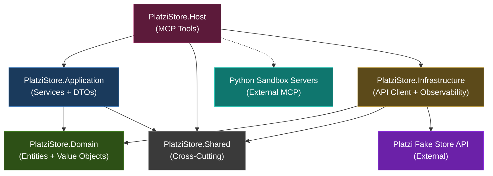

# Platzi Store MCP Extension — C# Architecture Design

**Date**: 2026-03-10
**Platform**: Sandbox MCP Tools for Cursor
**Language**: C# / .NET 9
**Architecture**: Clean Architecture
**Integration Target**: [Platzi Fake Store API](https://fakeapi.platzi.com/)

---

## Table of Contents

1. [Overview](#overview)
2. [Platform Context](#platform-context)
3. [Project Structure](#project-structure)
4. [Layer Responsibilities](#layer-responsibilities)
5. [API Endpoint → MCP Tool Mapping](#api-endpoint--mcp-tool-mapping)
6. [Domain Entities](#domain-entities)
7. [Integration with Python MCP Servers](#integration-with-python-mcp-servers)
8. [Testing Strategy](#testing-strategy)
9. [Dependency Graph](#dependency-graph)

---

## Overview

This document describes the architecture for a new **C# .NET MCP server** that
integrates with the Platzi Fake Store API and exposes store operations as MCP
tools consumable by Cursor and other AI clients.

The server follows **Clean Architecture** with five distinct layers, each with
a clearly bounded responsibility. It extends the existing multi-service MCP
platform without modifying any of the Python-based sandbox tools.

### Design Principles

- **Separation of Concerns**: Each layer owns a single axis of change
- **Dependency Inversion**: Inner layers define abstractions; outer layers implement them
- **Testability**: Every layer can be tested in isolation
- **Minimal Coupling**: The C# service communicates with Python services only via MCP protocol when needed, never through shared state

---

## Platform Context

The existing platform already provides these MCP servers (Python):

| Server | Transport | Tools |
|--------|-----------|-------|
| `sandbox-python` | stdio | `execute_python`, `execute_python_file` |
| `sandbox-bash` | stdio | `execute_bash` |
| `sandbox-file` | stdio | `read_file`, `write_file`, `list_files` |

The new C# MCP server (`platzi-storefront`) runs **independently** as a
separate stdio process. Cursor manages it as an additional MCP server entry
alongside the Python servers.

```
┌──────────────────────────────────────────────────────────┐
│                      Cursor AI Client                    │
│                                                          │
│  MCP Server Registry:                                    │
│  ┌──────────────────┐  ┌──────────────────┐             │
│  │ sandbox-python   │  │ sandbox-bash     │             │
│  │ (Python/stdio)   │  │ (Python/stdio)   │             │
│  └──────────────────┘  └──────────────────┘             │
│  ┌──────────────────┐  ┌──────────────────┐             │
│  │ sandbox-file     │  │ platzi-storefront│  ◄── NEW    │
│  │ (Python/stdio)   │  │ (C#/stdio)       │             │
│  └──────────────────┘  └──────────────────┘             │
└──────────────────────────────────────────────────────────┘
         │                        │
         ▼                        ▼
   ┌──────────┐          ┌────────────────┐
   │  Docker   │          │  Platzi Fake   │
   │  Sandbox  │          │  Store API     │
   └──────────┘          └────────────────┘
```

---

## Project Structure

```
store-mcp/
├── PlatziStoreMcp.sln
│
├── src/
│   ├── PlatziStore.Host/                          # MCP Host / API Layer
│   │   ├── Program.cs                            # Server bootstrap & DI container
│   │   ├── Startup.cs                            # Service registration & pipeline
│   │   ├── Tools/
│   │   │   ├── CatalogBrowsingTools.cs           # Product listing, filtering, details
│   │   │   ├── CatalogManagementTools.cs         # Product CRUD operations
│   │   │   ├── CategoryBrowsingTools.cs          # Category listing and details
│   │   │   ├── CategoryManagementTools.cs        # Category CRUD operations
│   │   │   ├── CustomerAccountTools.cs           # User management tools
│   │   │   ├── IdentityAccessTools.cs            # Auth (login, profile, token refresh)
│   │   │   └── SandboxBridgeTools.cs             # Cross-service bridge to Python sandbox
│   │   └── PlatziStore.Host.csproj
│   │
│   ├── PlatziStore.Application/                   # Application Layer
│   │   ├── Contracts/
│   │   │   ├── ICatalogQueryService.cs           # Product query operations
│   │   │   ├── ICatalogCommandService.cs         # Product mutation operations
│   │   │   ├── ICategoryQueryService.cs          # Category query operations
│   │   │   ├── ICategoryCommandService.cs        # Category mutation operations
│   │   │   ├── ICustomerAccountService.cs        # User management operations
│   │   │   └── IIdentityAccessService.cs         # Auth operations
│   │   ├── Services/
│   │   │   ├── CatalogQueryHandler.cs            # Product query implementation
│   │   │   ├── CatalogCommandHandler.cs          # Product mutation implementation
│   │   │   ├── CategoryQueryHandler.cs           # Category query implementation
│   │   │   ├── CategoryCommandHandler.cs         # Category mutation implementation
│   │   │   ├── CustomerAccountHandler.cs         # User management implementation
│   │   │   └── IdentityAccessHandler.cs          # Auth implementation
│   │   ├── DataTransfer/
│   │   │   ├── CatalogItemSummary.cs             # Product list DTO
│   │   │   ├── CatalogItemDetail.cs              # Product detail DTO
│   │   │   ├── CatalogFilterCriteria.cs          # Product filter parameters DTO
│   │   │   ├── CatalogItemPayload.cs             # Product create/update DTO
│   │   │   ├── CategorySummary.cs                # Category list DTO
│   │   │   ├── CategoryPayload.cs                # Category create/update DTO
│   │   │   ├── CustomerProfile.cs                # User profile DTO
│   │   │   ├── CustomerRegistration.cs           # User create DTO
│   │   │   ├── AuthCredentials.cs                # Login credentials DTO
│   │   │   ├── AuthTokenPair.cs                  # Access/refresh token DTO
│   │   │   └── PaginationEnvelope.cs             # Pagination parameters DTO
│   │   ├── Mapping/
│   │   │   └── EntityMapper.cs                   # Domain ↔ DTO mapping
│   │   └── PlatziStore.Application.csproj
│   │
│   ├── PlatziStore.Domain/                        # Domain Layer
│   │   ├── Entities/
│   │   │   ├── Merchandise.cs                    # Product domain entity
│   │   │   ├── ProductGroup.cs                   # Category domain entity
│   │   │   └── StoreCustomer.cs                  # User domain entity
│   │   ├── ValueObjects/
│   │   │   ├── MonetaryAmount.cs                 # Price value object
│   │   │   ├── SlugIdentifier.cs                 # URL-safe slug
│   │   │   ├── EmailAddress.cs                   # Validated email
│   │   │   └── ImageUrl.cs                       # Validated image URL
│   │   ├── Exceptions/
│   │   │   ├── EntityNotFoundException.cs        # Resource not found
│   │   │   ├── InvalidEntityStateException.cs    # Validation failures
│   │   │   └── AuthorizationDeniedException.cs   # Auth failures
│   │   └── PlatziStore.Domain.csproj
│   │
│   ├── PlatziStore.Infrastructure/                # Infrastructure Layer
│   │   ├── ApiClients/
│   │   │   ├── PlatziStoreGateway.cs             # HTTP client for Platzi API
│   │   │   ├── PlatziStoreEndpoints.cs           # Endpoint URL constants
│   │   │   └── PlatziStoreResponseParser.cs      # JSON → Domain mapping
│   │   ├── Configuration/
│   │   │   ├── PlatziStoreOptions.cs             # API configuration (base URL, timeouts)
│   │   │   └── TelemetryOptions.cs               # Logging/metrics config
│   │   ├── Observability/
│   │   │   ├── StructuredEventLogger.cs          # Structured logging adapter
│   │   │   └── ToolInvocationMetrics.cs          # MCP tool call metrics
│   │   └── PlatziStore.Infrastructure.csproj
│   │
│   └── PlatziStore.Shared/                        # Shared / Cross-Cutting Layer
│       ├── Models/
│       │   ├── OperationOutcome.cs               # Generic Result<T> wrapper
│       │   └── PagedCollection.cs                # Paginated list wrapper
│       ├── Exceptions/
│       │   ├── ExternalServiceException.cs       # External API failure
│       │   └── ConfigurationMissingException.cs  # Missing config
│       ├── Utilities/
│       │   ├── JsonSerializationDefaults.cs      # System.Text.Json settings
│       │   └── SlugGenerator.cs                  # Slug creation utility
│       └── PlatziStore.Shared.csproj
│
├── tests/
│   ├── PlatziStore.Application.Tests/             # Unit tests
│   │   ├── CatalogQueryHandlerTests.cs
│   │   ├── CatalogCommandHandlerTests.cs
│   │   ├── CategoryQueryHandlerTests.cs
│   │   ├── CategoryCommandHandlerTests.cs
│   │   ├── CustomerAccountHandlerTests.cs
│   │   ├── IdentityAccessHandlerTests.cs
│   │   └── PlatziStore.Application.Tests.csproj
│   │
│   ├── PlatziStore.Infrastructure.Tests/          # API client tests
│   │   ├── PlatziStoreGatewayTests.cs
│   │   ├── PlatziStoreResponseParserTests.cs
│   │   └── PlatziStore.Infrastructure.Tests.csproj
│   │
│   └── PlatziStore.Host.Tests/                    # Integration tests
│       ├── CatalogBrowsingToolsTests.cs
│       ├── CatalogManagementToolsTests.cs
│       ├── CategoryBrowsingToolsTests.cs
│       ├── CategoryManagementToolsTests.cs
│       ├── CustomerAccountToolsTests.cs
│       ├── IdentityAccessToolsTests.cs
│       └── PlatziStore.Host.Tests.csproj
│
└── docker/
    └── Dockerfile.platzistore                     # Container image for C# MCP server
```

---

## Layer Responsibilities

### 1. MCP Host Layer (`PlatziStore.Host`)

**Purpose**: MCP server bootstrap, tool registration, and stdio transport handling.

| Responsibility | Detail |
|---------------|--------|
| Server lifecycle | `Program.cs` initializes the MCP server and configures DI |
| Tool registration | Each `*Tools.cs` class declares MCP tools with typed parameters |
| Input validation | Validates MCP tool parameters before delegating to Application layer |
| Response shaping | Formats service results as structured text for Cursor |
| Sandbox bridge | `SandboxBridgeTools.cs` provides tools that delegate to Python sandbox servers |

**Dependencies**: → Application, Shared

### 2. Application Layer (`PlatziStore.Application`)

**Purpose**: Business logic orchestration, DTO mapping, and service contracts.

| Responsibility | Detail |
|---------------|--------|
| Service interfaces | `Contracts/` defines what operations are available (ports) |
| Service handlers | `Services/` implements business rules and calls infrastructure |
| DTOs | `DataTransfer/` defines the shapes that cross layer boundaries |
| Mapping | `EntityMapper.cs` converts Domain entities ↔ DTOs |

**Dependencies**: → Domain, Shared

### 3. Domain Layer (`PlatziStore.Domain`)

**Purpose**: Core business entities, value objects, and domain rules. **Zero external dependencies.**

| Responsibility | Detail |
|---------------|--------|
| Entities | `Merchandise` (product), `ProductGroup` (category), `StoreCustomer` (user) |
| Value objects | `MonetaryAmount`, `SlugIdentifier`, `EmailAddress`, `ImageUrl` — self-validating |
| Domain exceptions | Typed exceptions for domain rule violations |

**Dependencies**: None (innermost layer)

### 4. Infrastructure Layer (`PlatziStore.Infrastructure`)

**Purpose**: External service integration, API clients, and observability.

| Responsibility | Detail |
|---------------|--------|
| API gateway | `PlatziStoreGateway` — typed `HttpClient` for all Platzi endpoints |
| URL management | `PlatziStoreEndpoints` — centralized endpoint constants |
| Response parsing | `PlatziStoreResponseParser` — JSON deserialization with error handling |
| Configuration | `PlatziStoreOptions` — base URL, retry policy, timeout settings |
| Observability | Structured logging and MCP tool invocation metrics |

**Dependencies**: → Domain, Shared, `System.Net.Http`, `Microsoft.Extensions.*`

### 5. Shared Layer (`PlatziStore.Shared`)

**Purpose**: Cross-cutting concerns used by all layers.

| Responsibility | Detail |
|---------------|--------|
| Result wrapper | `OperationOutcome<T>` — success/failure pattern with error details |
| Pagination | `PagedCollection<T>` — generic paginated result |
| Exceptions | `ExternalServiceException`, `ConfigurationMissingException` |
| Utilities | JSON serialization defaults, slug generation |

**Dependencies**: None (referenced by all layers)

---

## API Endpoint → MCP Tool Mapping

### Products — Browsing (CatalogBrowsingTools)

| API Endpoint | HTTP | MCP Tool Name | Parameters | Output |
|-------------|------|--------------|------------|--------|
| `GET /products` | GET | `list_store_products` | `offset?: int`, `limit?: int` | Paginated product list (JSON array) |
| `GET /products/{id}` | GET | `get_product_by_id` | `productId: int` | Single product detail (JSON) |
| `GET /products/slug/{slug}` | GET | `get_product_by_slug` | `slug: string` | Single product detail (JSON) |
| `GET /products/{id}/related` | GET | `find_related_products` | `productId: int` | Related products list (JSON array) |
| `GET /products/slug/{slug}/related` | GET | `find_related_by_slug` | `slug: string` | Related products list (JSON array) |
| `GET /products/?title=X&price_min=Y&...` | GET | `filter_store_products` | `title?: string`, `price?: int`, `priceMin?: int`, `priceMax?: int`, `categoryId?: int`, `categorySlug?: string`, `offset?: int`, `limit?: int` | Filtered product list (JSON array) |

### Products — Management (CatalogManagementTools)

| API Endpoint | HTTP | MCP Tool Name | Parameters | Output |
|-------------|------|--------------|------------|--------|
| `POST /products` | POST | `create_store_product` | `title: string`, `price: int`, `description: string`, `categoryId: int`, `images: string[]` | Created product (JSON) |
| `PUT /products/{id}` | PUT | `update_store_product` | `productId: int`, `title?: string`, `price?: int`, `description?: string`, `categoryId?: int`, `images?: string[]` | Updated product (JSON) |
| `DELETE /products/{id}` | DELETE | `remove_store_product` | `productId: int` | Success/failure message |

### Categories — Browsing (CategoryBrowsingTools)

| API Endpoint | HTTP | MCP Tool Name | Parameters | Output |
|-------------|------|--------------|------------|--------|
| `GET /categories` | GET | `list_store_categories` | — | All categories (JSON array) |
| `GET /categories/{id}` | GET | `get_category_by_id` | `categoryId: int` | Single category (JSON) |
| `GET /categories/slug/{slug}` | GET | `get_category_by_slug` | `slug: string` | Single category (JSON) |
| `GET /categories/{id}/products` | GET | `list_products_in_category` | `categoryId: int`, `offset?: int`, `limit?: int` | Products in category (JSON array) |

### Categories — Management (CategoryManagementTools)

| API Endpoint | HTTP | MCP Tool Name | Parameters | Output |
|-------------|------|--------------|------------|--------|
| `POST /categories` | POST | `create_store_category` | `name: string`, `image: string` | Created category (JSON) |
| `PUT /categories/{id}` | PUT | `update_store_category` | `categoryId: int`, `name?: string`, `image?: string` | Updated category (JSON) |
| `DELETE /categories/{id}` | DELETE | `remove_store_category` | `categoryId: int` | Success/failure message |

### Users (CustomerAccountTools)

| API Endpoint | HTTP | MCP Tool Name | Parameters | Output |
|-------------|------|--------------|------------|--------|
| `GET /users` | GET | `list_store_customers` | — | All users (JSON array) |
| `GET /users/{id}` | GET | `get_customer_by_id` | `customerId: int` | Single user (JSON) |
| `POST /users` | POST | `register_customer` | `name: string`, `email: string`, `password: string`, `avatar: string` | Created user (JSON) |
| `PUT /users/{id}` | PUT | `update_customer_profile` | `customerId: int`, `name?: string`, `email?: string` | Updated user (JSON) |
| `POST /users/is-available` | POST | `check_email_availability` | `email: string` | `{ isAvailable: bool }` |

### Authentication (IdentityAccessTools)

| API Endpoint | HTTP | MCP Tool Name | Parameters | Output |
|-------------|------|--------------|------------|--------|
| `POST /auth/login` | POST | `authenticate_customer` | `email: string`, `password: string` | Token pair (JSON) |
| `GET /auth/profile` | GET | `get_authenticated_profile` | `accessToken: string` | User profile (JSON) |
| `POST /auth/refresh-token` | POST | `refresh_access_token` | `refreshToken: string` | New token pair (JSON) |

### Sandbox Bridge (SandboxBridgeTools)

| Purpose | MCP Tool Name | Parameters | Behavior |
|---------|--------------|------------|----------|
| Run Python analysis on store data | `analyze_store_data` | `code: string`, `timeout?: int` | Exports store data to workspace → invokes `sandbox-python` |
| Run Bash on store exports | `process_store_export` | `command: string` | Runs commands on exported data via `sandbox-bash` |

**Total**: **26 MCP tools** across 7 tool classes.

---

## Domain Entities

### Merchandise (Product)

```csharp
public class Merchandise
{
    public int Id { get; init; }
    public string Title { get; init; }
    public SlugIdentifier Slug { get; init; }
    public MonetaryAmount Price { get; init; }
    public string Description { get; init; }
    public ProductGroup Category { get; init; }
    public IReadOnlyList<ImageUrl> Images { get; init; }
}
```

### ProductGroup (Category)

```csharp
public class ProductGroup
{
    public int Id { get; init; }
    public string Name { get; init; }
    public SlugIdentifier Slug { get; init; }
    public ImageUrl CoverImage { get; init; }
}
```

### StoreCustomer (User)

```csharp
public class StoreCustomer
{
    public int Id { get; init; }
    public EmailAddress Email { get; init; }
    public string DisplayName { get; init; }
    public string Role { get; init; }
    public ImageUrl Avatar { get; init; }
}
```

### Value Objects

| Value Object | Validation | Example |
|-------------|-----------|---------|
| `MonetaryAmount` | Must be ≥ 0 | `MonetaryAmount.From(687)` |
| `SlugIdentifier` | Non-empty, lowercase, hyphens only | `SlugIdentifier.From("handmade-fresh-table")` |
| `EmailAddress` | Valid email format | `EmailAddress.From("john@mail.com")` |
| `ImageUrl` | Valid URI with scheme | `ImageUrl.From("https://placehold.co/600x400")` |

---

## Integration with Python MCP Servers

The C# MCP server (`platzi-storefront`) and the Python MCP servers run as
**independent processes**. There is no direct function call or shared state
between them.

### How They Coexist

```json
// Cursor MCP Settings (cursor-settings.json)
{
  "mcpServers": {
    "sandbox-python": {
      "type": "stdio",
      "command": "python",
      "args": ["src/servers/python_server.py"]
    },
    "sandbox-bash": {
      "type": "stdio",
      "command": "python",
      "args": ["src/servers/bash_server.py"]
    },
    "sandbox-file": {
      "type": "stdio",
      "command": "python",
      "args": ["src/servers/file_server.py"]
    },
    "platzi-storefront": {
      "type": "stdio",
      "command": "dotnet",
      "args": ["run", "--project", "store-mcp/src/PlatziStore.Host"]
    }
  }
}
```

### Cross-Service Interaction Pattern

When the AI needs to combine store data with sandbox capabilities
(e.g., "Analyze product prices using Python pandas"), Cursor orchestrates
the workflow by calling tools from both servers:

```
Cursor AI                  platzi-storefront             sandbox-file            sandbox-python
   │                             │                           │                        │
   │──list_store_products()─────►│                           │                        │
   │◄──[product JSON data]──────│                           │                        │
   │                             │                           │                        │
   │──write_file("data.json")──────────────────────────────►│                        │
   │◄──"Successfully wrote"─────────────────────────────────│                        │
   │                             │                           │                        │
   │──execute_python("import pandas...")────────────────────────────────────────────►│
   │◄──[analysis results]──────────────────────────────────────────────────────────│
```

### Sandbox Bridge (Optional)

The `SandboxBridgeTools` in the C# server provides convenience tools that
automate the above pattern. They:

1. Fetch store data via the Platzi API
2. Write it to the sandbox workspace via the `sandbox-file` server
3. Invoke Python/Bash processing via `sandbox-python`/`sandbox-bash` servers

This is implemented by having the C# server call the Python MCP servers
through Cursor's tool orchestration layer (AI-driven chaining), or by
exposing these as composite tools that the C# server coordinates itself.

> **Important**: The C# server does NOT replicate the Docker sandbox runtime.
> It only provides a higher-level interface that leverages the existing
> sandbox infrastructure when needed.

---

## Testing Strategy

### Unit Tests (`PlatziStore.Application.Tests`)

**Framework**: xUnit + Moq + FluentAssertions

Test each Application service handler in isolation by mocking the
infrastructure layer (API gateway).

| Test Class | Covers |
|-----------|--------|
| `CatalogQueryHandlerTests` | Product listing, detail retrieval, filtering, pagination edge cases |
| `CatalogCommandHandlerTests` | Product creation with validation, update with partial fields, deletion |
| `CategoryQueryHandlerTests` | Category listing, detail by ID/slug, products-by-category |
| `CategoryCommandHandlerTests` | Category CRUD with validation |
| `CustomerAccountHandlerTests` | User listing, creation with email validation, profile updates |
| `IdentityAccessHandlerTests` | Login success/failure, token refresh, profile retrieval |

```bash
dotnet test store-mcp/tests/PlatziStore.Application.Tests --verbosity normal
```

### Infrastructure Tests (`PlatziStore.Infrastructure.Tests`)

**Framework**: xUnit + WireMock.Net

Test the `PlatziStoreGateway` HTTP client against a mock HTTP server
(WireMock) that simulates Platzi API responses.

| Test Class | Covers |
|-----------|--------|
| `PlatziStoreGatewayTests` | HTTP calls, query string construction, error response handling, timeout behavior |
| `PlatziStoreResponseParserTests` | JSON deserialization, malformed response handling, null field defaults |

```bash
dotnet test store-mcp/tests/PlatziStore.Infrastructure.Tests --verbosity normal
```

### MCP Integration Tests (`PlatziStore.Host.Tests`)

**Framework**: xUnit + `Microsoft.Extensions.DependencyInjection`

Test MCP tools end-to-end by bootstrapping the server with a mock
HTTP handler injected into the DI container — verifying that tool
invocations produce correctly formatted responses.

| Test Class | Covers |
|-----------|--------|
| `CatalogBrowsingToolsTests` | `list_store_products`, `get_product_by_id`, `filter_store_products` |
| `CatalogManagementToolsTests` | `create_store_product`, `update_store_product`, `remove_store_product` |
| `CategoryBrowsingToolsTests` | `list_store_categories`, `get_category_by_id`, `list_products_in_category` |
| `CategoryManagementToolsTests` | `create_store_category`, `update_store_category`, `remove_store_category` |
| `CustomerAccountToolsTests` | `list_store_customers`, `register_customer`, `check_email_availability` |
| `IdentityAccessToolsTests` | `authenticate_customer`, `get_authenticated_profile`, `refresh_access_token` |

```bash
dotnet test store-mcp/tests/PlatziStore.Host.Tests --verbosity normal

# Run ALL tests:
dotnet test store-mcp/PlatziStoreMcp.sln --verbosity normal
```

---

## Dependency Graph



### NuGet Dependencies

| Project | Key Packages |
|---------|-------------|
| `PlatziStore.Host` | `ModelContextProtocol`, `Microsoft.Extensions.Hosting` |
| `PlatziStore.Application` | `Microsoft.Extensions.DependencyInjection.Abstractions` |
| `PlatziStore.Domain` | *(no external packages)* |
| `PlatziStore.Infrastructure` | `Microsoft.Extensions.Http`, `Microsoft.Extensions.Logging`, `System.Text.Json` |
| `PlatziStore.Shared` | `System.Text.Json` |
| Test projects | `xunit`, `Moq`, `FluentAssertions`, `WireMock.Net`, `Microsoft.NET.Test.Sdk` |

---

## Cursor Configuration

To register the new C# MCP server alongside the existing Python servers,
add the following to Cursor's MCP configuration:

```json
{
  "name": "platzi-storefront",
  "type": "stdio",
  "command": "dotnet",
  "args": ["run", "--project", "store-mcp/src/PlatziStore.Host"]
}
```

The server will be discovered by Cursor and all 26 tools will be available
for AI-driven interactions with the Platzi Fake Store API.

---

## Implementation Phases

### Phase 1 — Project Initialization

**Description**: Scaffold the .NET solution, create all five project shells
with correct inter-project references, and configure the build pipeline.

**Tasks**:

1. Create `store-mcp/` root directory with `PlatziStoreMcp.sln`
2. Create the five `src/` projects: `PlatziStore.Host`, `PlatziStore.Application`,
   `PlatziStore.Domain`, `PlatziStore.Infrastructure`, `PlatziStore.Shared`
3. Create the three `tests/` projects: `PlatziStore.Application.Tests`,
   `PlatziStore.Infrastructure.Tests`, `PlatziStore.Host.Tests`
4. Add inter-project references matching the Dependency Graph:
   - Host → Application, Infrastructure, Shared
   - Application → Domain, Shared
   - Infrastructure → Domain, Shared
5. Add NuGet package references per the NuGet Dependencies table
6. Configure `Directory.Build.props` with shared settings (target framework,
   nullable, implicit usings)
7. Verify `dotnet build PlatziStoreMcp.sln` compiles with zero errors

**Outputs**:

- `PlatziStoreMcp.sln` with 8 projects
- All `.csproj` files with correct references
- `Directory.Build.props`
- Clean build confirmation

---

### Phase 2 — Domain Modeling

**Description**: Implement the innermost layer — entities, value objects, and
domain exceptions. This layer has zero external dependencies.

**Tasks**:

1. Create `Merchandise.cs` with properties: `Id`, `Title`, `Slug`, `Price`,
   `Description`, `Category`, `Images` (referencing value objects)
2. Create `ProductGroup.cs` with properties: `Id`, `Name`, `Slug`, `CoverImage`
3. Create `StoreCustomer.cs` with properties: `Id`, `Email`, `DisplayName`,
   `Role`, `Avatar`
4. Create value objects with self-validation:
   - `MonetaryAmount` — rejects negative values
   - `SlugIdentifier` — enforces lowercase, hyphen-delimited format
   - `EmailAddress` — validates email format
   - `ImageUrl` — validates URI with http/https scheme
5. Create domain exceptions:
   - `EntityNotFoundException`
   - `InvalidEntityStateException`
   - `AuthorizationDeniedException`

**Outputs**:

- `PlatziStore.Domain/Entities/Merchandise.cs`
- `PlatziStore.Domain/Entities/ProductGroup.cs`
- `PlatziStore.Domain/Entities/StoreCustomer.cs`
- `PlatziStore.Domain/ValueObjects/MonetaryAmount.cs`
- `PlatziStore.Domain/ValueObjects/SlugIdentifier.cs`
- `PlatziStore.Domain/ValueObjects/EmailAddress.cs`
- `PlatziStore.Domain/ValueObjects/ImageUrl.cs`
- `PlatziStore.Domain/Exceptions/EntityNotFoundException.cs`
- `PlatziStore.Domain/Exceptions/InvalidEntityStateException.cs`
- `PlatziStore.Domain/Exceptions/AuthorizationDeniedException.cs`

---

### Phase 3 — Infrastructure Integration (Platzi API Client)

**Description**: Build the typed HTTP client that communicates with the Platzi
Fake Store API, including endpoint constants, response parsing, and
configuration binding.

**Tasks**:

1. Create `PlatziStoreEndpoints.cs` with constants for all API routes
   (`/api/v1/products`, `/api/v1/categories`, `/api/v1/users`, `/api/v1/auth`)
2. Create `PlatziStoreOptions.cs` with configurable `BaseUrl`, `TimeoutSeconds`,
   and `RetryCount` — bound from `appsettings.json`
3. Create `PlatziStoreResponseParser.cs` to deserialize JSON responses into
   domain entities using `System.Text.Json`
4. Create `PlatziStoreGateway.cs` as a typed `HttpClient` implementing methods
   for every Platzi API endpoint:
   - Products: GetAll, GetById, GetBySlug, Create, Update, Delete, Filter,
     GetRelatedById, GetRelatedBySlug
   - Categories: GetAll, GetById, GetBySlug, Create, Update, Delete,
     GetProductsByCategory
   - Users: GetAll, GetById, Create, Update, CheckEmailAvailability
   - Auth: Login, GetProfile, RefreshToken
5. Implement error handling: map HTTP 404 → `EntityNotFoundException`,
   401/403 → `AuthorizationDeniedException`, 5xx → `ExternalServiceException`

**Outputs**:

- `PlatziStore.Infrastructure/ApiClients/PlatziStoreEndpoints.cs`
- `PlatziStore.Infrastructure/ApiClients/PlatziStoreGateway.cs`
- `PlatziStore.Infrastructure/ApiClients/PlatziStoreResponseParser.cs`
- `PlatziStore.Infrastructure/Configuration/PlatziStoreOptions.cs`

---

### Phase 4 — Application Services Implementation

**Description**: Implement the service contracts, handler classes, DTOs, and
entity mapping that orchestrate business logic between the MCP tools and the
infrastructure gateway.

**Tasks**:

1. Create the Shared layer foundations first:
   - `OperationOutcome<T>` (generic Result wrapper with success/failure)
   - `PagedCollection<T>` (paginated list wrapper with offset/limit/total)
   - `ExternalServiceException` and `ConfigurationMissingException`
   - `JsonSerializationDefaults` and `SlugGenerator`
2. Create all DTOs in `DataTransfer/`:
   - `CatalogItemSummary`, `CatalogItemDetail`, `CatalogFilterCriteria`,
     `CatalogItemPayload`
   - `CategorySummary`, `CategoryPayload`
   - `CustomerProfile`, `CustomerRegistration`
   - `AuthCredentials`, `AuthTokenPair`
   - `PaginationEnvelope`
3. Create service interfaces in `Contracts/`:
   - `ICatalogQueryService`, `ICatalogCommandService`
   - `ICategoryQueryService`, `ICategoryCommandService`
   - `ICustomerAccountService`, `IIdentityAccessService`
4. Implement service handlers in `Services/`:
   - `CatalogQueryHandler` — delegates to `PlatziStoreGateway`, maps results
     to DTOs via `EntityMapper`
   - `CatalogCommandHandler` — validates payloads, delegates mutations
   - `CategoryQueryHandler`, `CategoryCommandHandler`
   - `CustomerAccountHandler`, `IdentityAccessHandler`
5. Create `EntityMapper.cs` for Domain ↔ DTO conversions

**Outputs**:

- `PlatziStore.Shared/Models/OperationOutcome.cs`
- `PlatziStore.Shared/Models/PagedCollection.cs`
- `PlatziStore.Shared/Exceptions/ExternalServiceException.cs`
- `PlatziStore.Shared/Exceptions/ConfigurationMissingException.cs`
- `PlatziStore.Shared/Utilities/JsonSerializationDefaults.cs`
- `PlatziStore.Shared/Utilities/SlugGenerator.cs`
- All 11 DTO files in `PlatziStore.Application/DataTransfer/`
- All 6 interface files in `PlatziStore.Application/Contracts/`
- All 6 handler files in `PlatziStore.Application/Services/`
- `PlatziStore.Application/Mapping/EntityMapper.cs`

---

### Phase 5 — MCP Tool Layer Implementation

**Description**: Implement the MCP Host layer — server bootstrap, DI
registration, and all 24 core MCP tool definitions (excluding sandbox bridge).

**Tasks**:

1. Create `Program.cs` with MCP server bootstrap using `FastMCP` or
   `ModelContextProtocol` SDK, configured for stdio transport
2. Create `Startup.cs` to register all services, `HttpClient` factory,
   configuration binding, and logging
3. Implement `CatalogBrowsingTools.cs` with 6 tools:
   `list_store_products`, `get_product_by_id`, `get_product_by_slug`,
   `find_related_products`, `find_related_by_slug`, `filter_store_products`
4. Implement `CatalogManagementTools.cs` with 3 tools:
   `create_store_product`, `update_store_product`, `remove_store_product`
5. Implement `CategoryBrowsingTools.cs` with 4 tools:
   `list_store_categories`, `get_category_by_id`, `get_category_by_slug`,
   `list_products_in_category`
6. Implement `CategoryManagementTools.cs` with 3 tools:
   `create_store_category`, `update_store_category`, `remove_store_category`
7. Implement `CustomerAccountTools.cs` with 5 tools:
   `list_store_customers`, `get_customer_by_id`, `register_customer`,
   `update_customer_profile`, `check_email_availability`
8. Implement `IdentityAccessTools.cs` with 3 tools:
   `authenticate_customer`, `get_authenticated_profile`, `refresh_access_token`
9. Verify `dotnet run --project PlatziStore.Host` starts without errors and
   the server declares all 24 tools

**Outputs**:

- `PlatziStore.Host/Program.cs`
- `PlatziStore.Host/Startup.cs`
- 6 tool class files in `PlatziStore.Host/Tools/`
- Running MCP server on stdio with 24 registered tools

---

### Phase 6 — Python Sandbox Bridge Integration

**Description**: Add the bridge tools that allow Cursor to chain store data
operations with Python/Bash sandbox execution.

**Tasks**:

1. Implement `SandboxBridgeTools.cs` with 2 tools:
   - `analyze_store_data` — fetches store data, serializes to JSON, returns
     it for Cursor to pass to `sandbox-file` → `sandbox-python`
   - `process_store_export` — prepares store data for Bash processing
2. Document the cross-service orchestration pattern in tool descriptions
   so Cursor's AI knows how to chain the tools correctly
3. Verify the bridge works end-to-end by:
   - Calling `list_store_products` → writing result via `write_file` →
     running analysis via `execute_python`

**Outputs**:

- `PlatziStore.Host/Tools/SandboxBridgeTools.cs`
- End-to-end verification of cross-service tool chaining

---

### Phase 7 — Observability and Configuration

**Description**: Add structured logging, metrics collection, and externalized
configuration.

**Tasks**:

1. Create `StructuredEventLogger.cs` — wraps `ILogger<T>` with domain-specific
   log methods for tool invocations, API calls, and errors
2. Create `ToolInvocationMetrics.cs` — tracks tool call counts, durations, and
   error rates
3. Create `TelemetryOptions.cs` — configurable log levels and metrics export
4. Add `appsettings.json` with Platzi API base URL, timeouts, and logging config
5. Add structured log calls to every MCP tool (start, completion, warning)
6. Add metrics instrumentation to `PlatziStoreGateway` (HTTP call duration,
   status code distribution)

**Outputs**:

- `PlatziStore.Infrastructure/Observability/StructuredEventLogger.cs`
- `PlatziStore.Infrastructure/Observability/ToolInvocationMetrics.cs`
- `PlatziStore.Infrastructure/Configuration/TelemetryOptions.cs`
- `PlatziStore.Host/appsettings.json`

---

### Phase 8 — Testing Implementation

**Description**: Write unit, infrastructure, and integration tests across all
three test projects.

**Tasks**:

1. **Unit tests** (`PlatziStore.Application.Tests`):
   - `CatalogQueryHandlerTests` — mock gateway, verify DTO mapping, pagination
   - `CatalogCommandHandlerTests` — mock gateway, verify validation, error paths
   - `CategoryQueryHandlerTests` — mock gateway, verify category queries
   - `CategoryCommandHandlerTests` — mock gateway, verify category mutations
   - `CustomerAccountHandlerTests` — mock gateway, verify user operations
   - `IdentityAccessHandlerTests` — mock gateway, verify auth flows
2. **Infrastructure tests** (`PlatziStore.Infrastructure.Tests`):
   - `PlatziStoreGatewayTests` — use WireMock.Net to simulate Platzi API
     responses (success, 404, 500, timeout)
   - `PlatziStoreResponseParserTests` — test JSON deserialization with valid,
     malformed, and empty responses
3. **Integration tests** (`PlatziStore.Host.Tests`):
   - `CatalogBrowsingToolsTests` — invoke MCP tools with mocked HTTP backend
   - `CatalogManagementToolsTests` — verify CRUD tool responses
   - `CategoryBrowsingToolsTests` — verify category tool responses
   - `CategoryManagementToolsTests` — verify category mutation tools
   - `CustomerAccountToolsTests` — verify user management tools
   - `IdentityAccessToolsTests` — verify auth tools
4. Run full suite: `dotnet test store-mcp/PlatziStoreMcp.sln`

**Outputs**:

- 6 test files in `PlatziStore.Application.Tests/`
- 2 test files in `PlatziStore.Infrastructure.Tests/`
- 6 test files in `PlatziStore.Host.Tests/`
- All tests passing

---

### Phase 9 — MCP Server Integration with Cursor

**Description**: Configure the C# MCP server in Cursor alongside the existing
Python servers and verify end-to-end tool discovery.

**Tasks**:

1. Add the `platzi-storefront` entry to Cursor's MCP settings:
   ```json
   {
     "name": "platzi-storefront",
     "type": "stdio",
     "command": "dotnet",
     "args": ["run", "--project", "store-mcp/src/PlatziStore.Host"]
   }
   ```
2. Create `docker/Dockerfile.platzistore` for containerized deployment
3. Verify Cursor discovers all 27 tools from the `platzi-storefront` server
4. Verify Cursor can call tools from both Python and C# servers in the same
   conversation (multi-server orchestration)
5. Test cross-service workflows:
   - "List all products" → `list_store_products` (C# server)
   - "Save product data and analyze with Python" → `write_file` (Python)
     → `execute_python` (Python)

**Outputs**:

- Updated Cursor MCP configuration
- `docker/Dockerfile.platzistore`
- Verified multi-server tool discovery
- Verified cross-service workflow

---

### Phase 10 — Final Validation and Tool Discovery

**Description**: End-to-end validation of the complete platform, ensuring all
servers coexist, all tools are discoverable, and the architecture meets its
design goals.

**Tasks**:

1. Run full C# test suite: `dotnet test store-mcp/PlatziStoreMcp.sln -v normal`
2. Run full Python test suite: `pytest tests/ -v`
3. Verify all 27 C# tools are registered and respond correctly
4. Verify all 6 Python tools remain functional (no regressions)
5. Validate constitution compliance for the C# server:
   - Code quality (docstrings, naming)
   - Security (input validation, error masking)
   - Observability (structured logs on every tool)
   - Testability (all layers tested in isolation)
6. Perform manual smoke test via Cursor:
   - Browse products by category
   - Create a product, update it, delete it
   - Authenticate a user and retrieve their profile
   - Export store data to sandbox and analyze with Python
7. Document any known limitations or follow-up items

**Outputs**:

- All tests passing (C# + Python)
- Manual smoke test results
- Platform validation report
- Ready for production use
